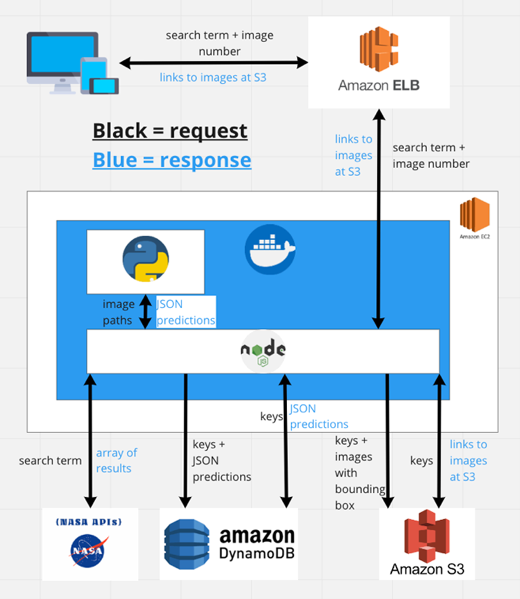
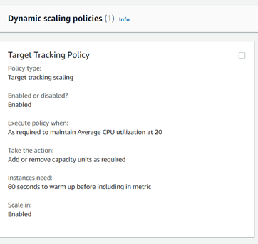
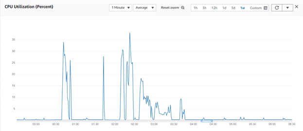
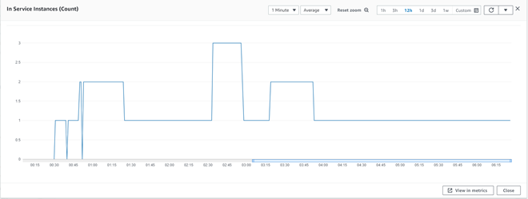
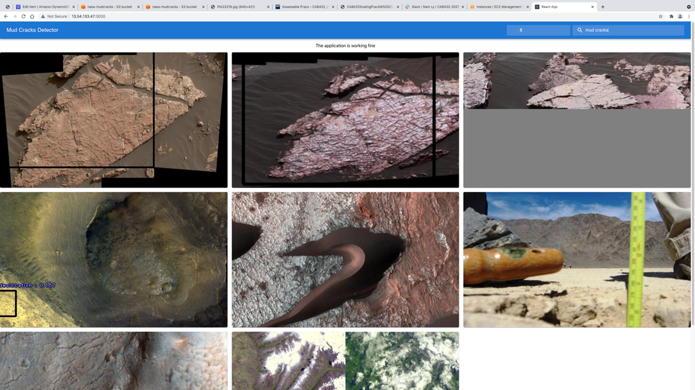

# Mudcracks detector
Mudcracks detector is a scalable web application for detecting mudcracks images. The application has a stateless architecture and uses two persistence services: DynamoDB and S3 Bucket.

## Purpose
NASA are interested in mud cracks, as they are signs of a watery ancient past on Mars. QUT Space White Belly Sea Eagles Team has been developing a model, trained with 600 images of mud cracks on Earth, for detecting mud cracks in general. The model is available as an Azure Custom Vision endpoint. This leads to the idea of developing a web application for predicting images, along with scalability and persistence.
Using our web application, the user will be able to search for images in NASA’s media bank and then, our machine learning model will predict whether there are mud cracks in those images.

## Data Flow Diagram



## Architecture Diagram


## Scaling performance
### Scaling Policy

The application scales out when the average CPU utilization is over 20%, scaling between one and three instances. While 20% is a small benchmark for CPU performance, it successfully demonstrates the auto-scaling performance of this application. For achieving higher CPU performance such as 60%, the application is more likely to crash due to Tensorflow exceeding the memory of the t3.medium instance, before using the CPU for prediction capabilities. Therefore, average CPU utilization at 20% would ensure stabilize the performance of the application. 
### CPU Performance




## User guide

To use the application, the user must enter the query and the number of images they want to see. 


### Setup

Prequisites:

1. Register for an AWS account 
2. Create a DynamoDB database and a S3 Bucket

Installation guides:

1. Install [Docker](https://www.docker.com)

```bash
sudo curl -fsSL https://get.docker.com/ | sh
```

2. Clone the directory

```bash
git clone https://github.com/phuongnamly/CAB420-MachineLearning.git
```

3. Configure [AWS credentials](https://docs.aws.amazon.com/sdk-for-java/v1/developer-guide/setup-credentials.html)

4. Use docker build and docker run

```bash
docker build -t mudscrack .
docker run -p 80:4001 mudscrack
```

5. Run the web localhost
```bash
http://localhost:4001
```